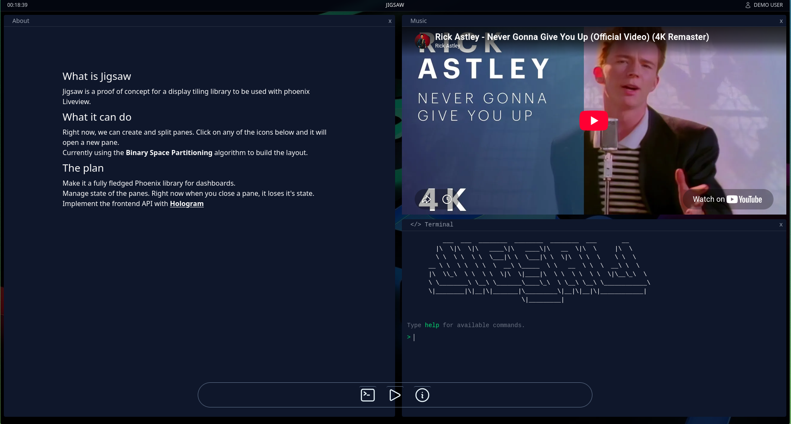

# Jigsaw

              ___  ___  ________  ________  ________  ___       __
            |\  \|\  \|\   ____\|\   ____\|\   __  \|\  \     |\  \
            \ \  \ \  \ \  \___|\ \  \___|\ \  \|\  \ \  \    \ \  \
          __ \ \  \ \  \ \  \  __\ \_____  \ \   __  \ \  \  __\ \  \
          |\  \\_\  \ \  \ \  \|\  \|____|\  \ \  \ \  \ \  \|\__\_\  \
          \ \________\ \__\ \_______\____\_\  \ \__\ \__\ \____________\
          \|________|\|__|\|_______|\_________\|__|\|__|\|____________|
                                    \|_________|

---

Jigsaw is a proof of concept for a display tiling library. "Right now, we can create and split panes. The layout is currently generated with a variant the binary space partitioning algorithm. Built with and for Elixir and Phoenix LiveView.

## Resources & References
- https://madnight.github.io/bspwm/
- https://jmelosegui.com/mosaico/
- https://tarmac.musicsian.com/
- ASCII test generated by: https://patorjk.com/software/taag/#p=display&f=3D-ASCII&t=JIGSAW&x=none&v=4&h=4&w=80&we=false
