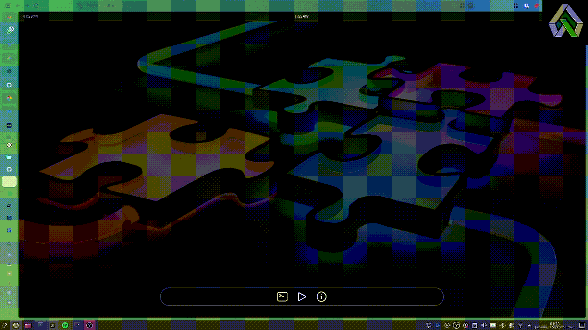

# Jigsaw
              ___  ___  ________  ________  ________  ___       __
            |\  \|\  \|\   ____\|\   ____\|\   __  \|\  \     |\  \
            \ \  \ \  \ \  \___|\ \  \___|\ \  \|\  \ \  \    \ \  \
          __ \ \  \ \  \ \  \  __\ \_____  \ \   __  \ \  \  __\ \  \
          |\  \\_\  \ \  \ \  \|\  \|____|\  \ \  \ \  \ \  \|\__\_\  \
          \ \________\ \__\ \_______\____\_\  \ \__\ \__\ \____________\
          \|________|\|__|\|_______|\_________\|__|\|__|\|____________|
                                    \|_________|



---

Jigsaw is a proof of concept for a display tiling library akin to what one would find with Dwindle on Hyprland. The layout is currently generated with a variant the binary space partitioning algorithm. Built with and for Elixir and Phoenix LiveView.

## Installation

If [available in Hex](https://hex.pm/docs/publish), the package can be installed
by adding `jigsaw` to your list of dependencies in `mix.exs`:

```elixir
def deps do
  [
    {:jigsaw, "~> 0.1.0"}
  ]
end
```

Documentation can be found at <https://hexdocs.pm/jigsaw>.


## Resources & References Used
- https://madnight.github.io/bspwm/
- https://jmelosegui.com/mosaico/
- https://tarmac.musicsian.com/
- ASCII test generated by: https://patorjk.com/software/taag/#p=display&f=3D-ASCII&t=JIGSAW&x=none&v=4&h=4&w=80&we=false
- https://launchscout.com/blog/key-combination-events-with-phoenix-liveview
